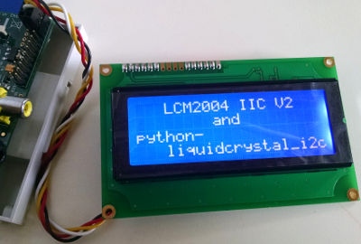

# python-liquidcrystal_i2c

licquidcrystal_i2c is a python library for the LCD-Module *LCM1602 IIC V2* and *LCM2004 IIC V2*. 
More information could be found in 
[dfrobot wiki](http://www.dfrobot.com/wiki/index.php?title=I2C/TWI_LCD1602_Module_(SKU:_DFR0063)).

This module is a port of the sources found 
[here](http://www.dfrobot.com/image/data/DFR0154/LiquidCrystal_I2Cv1-1.rar).



_[Keywords: LCM1602 IIC V2, LCM2004 IIC V2, LCM IIC V2, LCD1602 I2C, V1, V2, I2C1602V2, YWROBOT, DFROBOT]_

## Install

Install directly from gihtub using pip:
```
pip install https://github.com/pl31/python-liquidcrystal_i2c/archive/master.zip
```

Install directly from gihtub using easy_install as user:
```
python -m easy_install --user https://github.com/pl31/python-liquidcrystal_i2c/archive/master.zip
```

Install from cloned github repository (may need admin rights for `python setup.py install`):

```
git clone --depth=1 https://github.com/pl31/python-liquidcrystal_i2c.git
(cd python-liquidcrystal_i2c/ && python setup.py install)
```

### Dependencies

python-liquidcrystal_i2c depends on a ```smbus```-distribution.

### Access rights

python-liquidcrystal_i2c needs read/write access to the i2c-bus.
Either add your user to the i2c group (`adduser <user> i2c`) or grant rights to anyone (`chmod 666 /dev/i2c-*`).

## Examples

### YWROBOT LCM2004 IIC V2

```
import liquidcrystal_i2c

cols = 20
rows = 4

lcd = liquidcrystal_i2c.LiquidCrystal_I2C(0x27, 1, numlines=rows)

lcd.printline(0, 'LCM2004 IIC V2'.center(cols))
lcd.printline(1, 'and'.center(cols))
lcd.printline(2, 'python-')
lcd.printline(3, 'liquidcrystal_i2c'.rjust(cols))
```

## Todo

Nice to have:

- A lot of methods from the original sources are still missing, as I do not need them. 
For a complete port these should be included
- Add docstring
